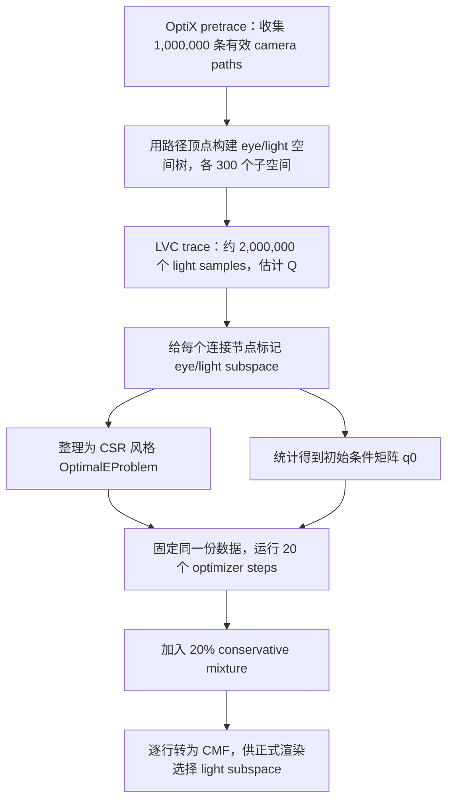

# Optimal E：样本、损失、梯度与三类优化器

本文解释当前工程中三类 Optimal-E 优化器的真实执行流程：

1. production CUDA probability-simplex mirror descent；
2. test-only fixed legacy CUDA normalized-sigmoid Adam；
3. Python/PyTorch active-masked softmax Adam。

它们不是三个渲染积分器。三者读取的是同一批 LVCBPT preprocessing 样本，
优化同一个 `300 × 300` 条件概率矩阵，只是参数化和更新方法不同。

## 先看结论

- 三种方法使用相同样本、相同输入 `q0` 和相同 loss；legacy sigmoid 会先
  clamp 再归一化，因此从 `q0` 的参数化投影而非逐元素完全相同的矩阵起步。
- 当前实验全部是 full-batch：20 步内不会重新追踪路径，也没有 mini-batch。
- CUDA mirror 的 `0.01` 初始学习率确实过小。114 组平均 loss 降幅从
  `4.96%` 提高到 `lr=1.0` 的 `18.89%`。
- PyTorch softmax Adam 平均降幅仍为 `20.62%`；它不是每组都赢，但在困难
  样本上取得的优势更大。
- 这支持在现有 CUDA 中实现 masked-softmax Adam，而不是把 LibTorch 链进
  renderer，也不支持把旧 normalized-sigmoid 原样恢复到生产路径。

## 一、从场景到训练问题



### 1. 收集 camera-path 样本

`RendererWorkflow::preprocessing()` 重复运行 OptiX pretrace，直到得到
`1,000,000` 条有效 camera paths。每条 `preTracePath` 保存：

- 路径贡献 `contri`；
- 生成该路径时的 `sample_pdf`；
- 不依赖待优化矩阵的固定密度 `fix_pdf`；
- 它在连接节点数组中的 `[begin_ind, end_ind)`。

无有效样本连续 64 批时直接报错，不会无限等待。

### 2. 构建 eye/light 子空间

从路径顶点建立两棵空间树，然后把 camera-side 顶点和 light-side 顶点分别
映射到离散子空间。当前维度固定为：

```text
num_eye = 300
num_light = 300
```

因此一个矩阵单元 `(r,c)` 表示：

> camera 顶点落在 eye subspace `r` 时，应以多大概率选择 light subspace `c`。

### 3. 估计先验 light 分布 Q

系统另外收集约 `2,000,000` 个 light samples，估计各 light subspace 的
基础支持 `Q[c]`。没有有效支持的列会被标记为 inactive：

```text
active[c] = 0  =>  q[r,c] 永远为 0
```

这不是普通的正则项，而是可采样性约束。空 light subspace 即使被 optimizer
赋予概率，运行时也没有顶点可选，所以必须在三种实现中统一屏蔽。

### 4. 构造训练数组

正式写入数组前还有一次历史 outlier 清理：先计算前 1000 条路径的
`loss / density` 代理并取其中最大值作为阈值，再把全体样本中超过阈值的
路径贡献清零。它是训练数据稳健化启发式，不属于 mirror/Adam 本身。

对路径 \(i\)，代码构造：

\[
w_i =
\min\left(
\frac{(C_i^R+C_i^G+C_i^B)^2}{p_i^{sample}},
10^6
\right),
\qquad
p_i^0 = p_i^{fixed}.
\]

这里 \(C_i\) 对应 `contri`；工程的 `float3weight(C)` 是 RGB 三通道之和，
不是欧氏范数。\(w_i\) 保存在 `f_squared`。非法、非有限或零贡献路径令
\(w_i=0\)，同时设置安全的 \(p_i^0=1\)，从 loss 中等价移除。

对路径中的连接节点 \(k\)，保存：

\[
a_k =
\begin{cases}
\dfrac{p_k^{peak}}{Q[c_k]}, & c_k\text{ active 且 }Q[c_k]>0,\\
0, & \text{否则},
\end{cases}
\]

以及展平索引：

\[
\operatorname{index}_k = r_k \cdot 300 + c_k.
\]

`path_offsets` 指出每条路径包含哪些连接节点，因此数据布局近似 CSR：

```text
path i
  ├─ w_i
  ├─ p0_i
  └─ nodes[offset[i] : offset[i+1]]
       ├─ peak_pdf a_k
       └─ matrix index (r_k, c_k)
```

### 5. 初始矩阵 q0

`preprocess_getGamma()` 先用样本统计产生 `q0`。每个连接按

\[
\min\left(\frac{C_i^R+C_i^G+C_i^B}{p_i^{sample}}, 10\right)
\]

累积到对应 `(eye, light)` 单元，然后逐行归一化；空行回退到均匀分布。
所以 optimizer 不是从随机矩阵开始，而是从已有路径统计得到的条件分布继续
微调。

## 二、实际优化变量与 conservative mixture

三种算法真正输出的都是基础分布 \(q\)：

\[
q_{r,c}\ge 0,\qquad
\sum_{c\in A}q_{r,c}=1,\qquad
q_{r,c}=0\;(c\notin A),
\]

其中 \(A\) 是 active light 集合，\(B=|A|\)。

loss 和正式渲染使用的有效概率为：

\[
E_{r,c}(q)=
\begin{cases}
(1-t)q_{r,c}+\dfrac{t}{B}, & c\in A,\\
0, & c\notin A,
\end{cases}
\qquad t=0.2.
\]

含义是：

- 80% 相信训练结果；
- 20% 保留 active light 上的均匀探索；
- 即使有限训练样本暂时没观察到某个有效 light subspace，它仍有非零概率。

训练结束后 `Gamma2CMFGamma()` 再按当前实际可采样的 light subspace
条件化，应用同一个 conservative mixture，最后逐行前缀和形成 CMF。

## 三、共同的 loss

给定 \(q\)，路径 \(i\) 在该分布下的有效密度为：

\[
D_i(q)
=p_i^0+
\sum_{k\in P_i}
a_k E_{r_k,c_k}(q).
\]

训练目标是：

\[
\boxed{
L(q)=\sum_{i=1}^{N}\frac{w_i}{D_i(q)}
}
\]

### 为什么是这个目标

Monte Carlo 方差可写成：

\[
\operatorname{Var}[\hat I]
=\mathbb E[\hat I^2]-I^2.
\]

对采样分布进行优化时，真实积分 \(I\) 不随采样概率改变，因此 \(I^2\) 是常数。
最小化估计量的二阶矩就等价于最小化方差。代码中的 \(w_i/D_i\) 是利用已有
路径样本形成的二阶矩代理。

所以：

- loss 更小意味着在这份训练路径上预测的二阶矩/方差更小；
- 它不是画面 MSE，也不直接等于最终图像误差；
- 有限样本可能过拟合，因此生产替换后仍应使用独立渲染样本做最终方差验收。

### 这个目标是否唯一

\(1/x\) 在 \(x>0\) 上是凸函数，而 \(D_i(q)\) 是 \(q\) 的仿射函数，所以
\(L(q)\) 在概率矩阵 \(q\) 上是凸目标，约束集合也是凸的。

但它不一定严格凸：

- 某些矩阵单元可能从未被样本使用；
- 多个列可能在数据中具有完全相同的作用；
- softmax logits 还具有整行加同一个常数而不改变 \(q\) 的冗余。

因此不同 optimizer 可能得到不同的 \(q\)，却具有几乎相同的 loss。正确性
对拍应比较固定 \(q\) 上的 loss/gradient，而不是要求最终矩阵逐元素一致。

## 四、共同的梯度

先对有效矩阵 \(E\) 求导。对单元 `(r,c)`：

\[
\frac{\partial L}{\partial E_{r,c}}
=-\sum_i
\frac{w_i}{D_i(q)^2}
\sum_{k\in P_i}
a_k\,
\mathbf 1[(r_k,c_k)=(r,c)].
\]

再经过 conservative mixture：

\[
g_{r,c}
=\frac{\partial L}{\partial q_{r,c}}
=(1-t)\frac{\partial L}{\partial E_{r,c}}.
\]

CUDA 的执行方式是：

1. 为每条 path 并行计算 \(D_i\)；
2. 算出该 path 的公共因子
   \(-w_i(1-t)/D_i^2\)；
3. 遍历该 path 的 nodes；
4. 用 `atomicAdd` 将
   \(-w_i(1-t)a_k/D_i^2\) 累加到对应矩阵单元。

未考虑每行概率和为 1 时，所有有效单元的偏导通常都是负数：单独提高任意
采样概率都会增大某些路径密度、降低 loss。真正的优化问题是，在行和固定为
1 的条件下，把概率从边际收益较小的列转移到边际收益较大的列。

## 五、算法一：production CUDA mirror descent

### 参数化

它直接保存可行概率 \(q\)，没有隐藏 logits，也不需要把普通梯度投影后再裁剪。

### 一步更新

对每个 active 单元：

\[
s_{r,c}
=\log(\max(q_{r,c},\epsilon))-\eta g_{r,c},
\]

\[
q'_{r,c}
=\frac{\exp(s_{r,c}-\max_j s_{r,j})}
{\sum_{j\in A}\exp(s_{r,j}-\max_k s_{r,k})}.
\]

等价写法是：

\[
\boxed{
q'_{r,c}\propto
\max(q_{r,c},\epsilon)\exp(-\eta g_{r,c})
}
\]

这叫 exponentiated-gradient/entropy mirror descent。它天然保持非负和逐行归一，
inactive 列保持 0。

两个列 \(j,k\) 的相对概率满足：

\[
\frac{q'_j}{q'_k}
=\frac{\max(q_j,\epsilon)}{\max(q_k,\epsilon)}
\,\exp[-\eta(g_j-g_k)].
\]

因此学习率 \(\eta\) 控制“一步重新分配多少概率”：

- \(\eta\) 太小：每步只做极轻微调整，20 步远未走够；
- \(\eta\) 较大：快速把概率移向梯度更负、降低 loss 更有效的列；
- \(\eta\) 过大：候选可能变差，由 backtracking 处理。

### backtracking

每一轮执行：

1. 在当前 \(q\) 上计算完整 gradient；
2. 从当前学习率开始生成候选 \(q'\)；
3. 重新计算完整 \(L(q')\)；
4. 若 \(L(q')\le L(q)\)，接受；
5. 否则令 \(\eta\leftarrow\eta/2\)，最多尝试 12 次；
6. 若全部失败，恢复旧 \(q\) 并停止。

被接受的 trial learning rate 会成为下一轮起点。当前实现只会缩小，不会主动
再次放大，所以初始值 `0.01` 会把全部 20 步限制在很保守的尺度。

### 特点

- 每个接受步骤都保证训练 loss 不增加；
- 没有 Adam moments，显存状态少；
- 对概率 simplex 很自然；
- 收敛速度高度依赖初始学习率和 backtracking 策略。

## 六、算法二：fixed legacy CUDA normalized-sigmoid Adam

这一版本只存在于 `tests/`，用于判断历史算法思路修复后能达到什么效果。

### 参数化

每个单元先有独立参数 \(\theta\)：

\[
s_{r,c}=\sigma(\theta_{r,c}),\qquad
q_{r,c}=\frac{s_{r,c}}{\sum_{j\in A}s_{r,j}}.
\]

初始参数由 `q0` 反求：

\[
\theta_{r,c}
=\log\frac{\operatorname{clamp}(q^0_{r,c})}
{1-\operatorname{clamp}(q^0_{r,c})}.
\]

clamp 是必要的，否则 `q=0/1` 会产生无穷 logits。
经过 clamp、sigmoid 和再次归一化后，legacy 的实际起点只是 `q0` 的参数化
投影；114 组中 initial objective 的最大偏移为 `0.02734375`。

### 精确链式梯度

设 \(g_c=\partial L/\partial q_c\)，
\(S=\sum_j s_j\)，则：

\[
\boxed{
\frac{\partial L}{\partial\theta_c}
=\frac{s_c(1-s_c)}{S}
\left(
g_c-\sum_j g_jq_j
\right)
}
\]

括号中的均值项来自逐行归一化。旧代码容易漏掉这一项，或者把 conservative
mixture 的导数重复计算；测试版本已经修正。

### Adam 更新

对 \(\theta\) 的梯度 \(h_t\)：

\[
m_t=\beta_1m_{t-1}+(1-\beta_1)h_t,
\]

\[
v_t=\beta_2v_{t-1}+(1-\beta_2)h_t^2,
\]

\[
\hat m_t=\frac{m_t}{1-\beta_1^t},
\qquad
\hat v_t=\frac{v_t}{1-\beta_2^t},
\]

\[
\theta_t
=\theta_{t-1}
-\eta\frac{\hat m_t}{\sqrt{\hat v_t}+\epsilon}.
\]

项目使用 \(\beta_1=0.9,\beta_2=0.999,\epsilon=10^{-8}\)。

### 与 mirror 的差异

- Adam 按每个参数的历史一、二阶矩自适应缩放；
- 没有 backtracking，不保证每一步 loss 单调；
- sigmoid 在参数很大或很小时会饱和，多出 \(s(1-s)\) 缩放；
- normalized sigmoid 与 softmax 不是同一种参数化。

114 组中，学习率从 `0.01` 改为 `0.05`，平均降幅从 `6.59%` 提升到
`19.55%`，说明原始旧实现的一个主要问题确实是步长过小。

## 七、算法三：PyTorch masked-softmax Adam

### 参数化

PyTorch 使用每行 masked softmax：

\[
q_{r,c}
=\frac{\exp(z_{r,c})}
{\sum_{j\in A}\exp(z_{r,j})},
\qquad c\in A.
\]

inactive logits 在 softmax 前设为 \(-\infty\)，因此对应概率严格为 0。
初始值使用：

\[
z^0_{r,c}=\log(\max(q^0_{r,c},\epsilon)),
\]

所以第一次 softmax 恢复同一个 `q0`。

### softmax 链式梯度

设 \(g_c=\partial L/\partial q_c\)，则：

\[
\boxed{
\frac{\partial L}{\partial z_c}
=q_c\left(g_c-\sum_jq_jg_j\right)
}
\]

PyTorch 用 autograd 得到该式，随后使用与 legacy 相同的 Adam 公式，当前
`lr=0.05`、20 steps。

### autograd 实际做了什么

每步不是让 PyTorch 重新生成样本，而是：

```text
固定 snapshot arrays
    ↓
z --masked softmax--> q
    ↓
q --conservative mixture--> E
    ↓
E --CSR scatter/add--> 每条路径 D_i
    ↓
L = sum(w_i / D_i)
    ↓ backward
dL/dz
    ↓ Adam.step()
新的 z
```

因此 PyTorch 的作用是自动组织链式求导和 Adam 状态，不是使用神经网络，
也没有训练一个 MLP。

### 为什么 softmax 通常优于 normalized sigmoid

softmax 的 Jacobian 只包含 \(q\) 和行内均值项；normalized sigmoid 还会被
\(1-s_c\) 调制。后者在 sigmoid 饱和时可能让某些参数移动更慢。

正式数据中，即使把 legacy Adam 学习率也设为 `0.05`，PyTorch 仍在
114/114 组取得更低 loss，平均领先约 `1.08` 个百分点。这说明差异不只来自
Adam 和学习率，softmax 参数化也有稳定贡献。

## 八、三类算法逐步对照

| 步骤 | CUDA mirror | Legacy CUDA Adam | PyTorch Adam |
|---|---|---|---|
| 输入样本 | 同一 `.spcoe` / `OptimalEProblem` | 同一份 | 同一份 |
| 初始矩阵 | `q0` | `q0 → clamp/inverse sigmoid → 归一化投影` | `q0 → log` |
| 参数 | 概率 `q` | sigmoid logits `θ` | softmax logits `z` |
| 每步 gradient | 手写 CUDA `dL/dq` | 同一 `dL/dq` + 手写链式 | autograd 完整链式 |
| 更新 | exponentiated mirror step | Adam | Adam |
| 可行性 | 更新后天然归一 | normalized sigmoid | masked softmax |
| 步长保护 | loss backtracking | 无 | 无 |
| 当前步数 | 20 full-batch | 20 full-batch | 20 full-batch |
| 是否重采样 | 否 | 否 | 否 |
| 当前用途 | renderer 生产实现 | tests 历史对照 | 离线 oracle |

## 九、CUDA mirror 学习率实验

固定 114 份真实 snapshot、同一 `q0`、同一 20 steps，测试：

```text
0.01 / 0.05 / 0.1 / 0.5 / 1.0
```

所有 final q 都由同一个 PyTorch float64 objective 重新评价。

| 初始学习率 | 平均 loss 降幅 | 中位降幅 | 最小—最大 | 容差内最佳组数 |
|---:|---:|---:|---:|---:|
| 0.01 | 4.96% | 2.08% | 0.002%—24.07% | 2 |
| 0.05 | 10.46% | 5.22% | 0.011%—37.67% | 4 |
| 0.10 | 13.29% | 6.75% | 0.022%—39.33% | 14 |
| 0.50 | 18.19% | 14.89% | 0.111%—51.54% | 31 |
| 1.00 | **18.89%** | **15.82%** | 0.222%—51.62% | **84** |

最佳组数允许并列，所以总和可以超过 114。五组学习率全部在 114/114 个样本
上接受了 20 步；这只表示每轮最终找到非增候选，不代表从未发生过减半。

### 与 PyTorch 的关系

| 方法 | 平均 loss 降幅 | 对 PyTorch 胜/负 |
|---|---:|---:|
| Mirror lr=0.01 | 4.96% | 5 / 109 |
| Mirror lr=0.50 | 18.19% | 48 / 66 |
| Mirror lr=1.00 | 18.89% | **64 / 50** |
| 每组从五个 mirror 候选中选最低 loss | 20.06% | **73 / 41** |
| PyTorch softmax Adam lr=0.05 | **20.62%** | — |

`lr=1.0` 虽然在 64 组中低于 PyTorch，但平均降幅仍更小。这并不矛盾：
PyTorch 在其获胜的困难样本上赢得更多，拉高了总体平均收益。

逐样本选择五个 mirror 候选后，平均降幅达到 `20.06%`，仍略低于 PyTorch
的 `20.62%`。因此：

1. 原 production mirror 的主要问题确实是初始学习率过小；
2. 调学习率能追回大部分差距；
3. softmax Adam 在总体稳定性上仍有剩余优势；
4. 当前验证性 renderer 采用固定 `lr=1.0` 作为 production 默认；若以后把
   optimizer 结论用于画质主张，仍需用独立路径样本检查方差是否同步改善。

## 十、一次完整训练到底发生什么

把所有步骤压缩成一次执行：

1. scene/config Apply 触发同步 preprocessing。
2. OptiX 生成一百万条有效 camera-path 样本。
3. 用样本建立 eye/light 子空间树。
4. LVC trace 估计 light support `Q`，inactive 列固定为 0。
5. 每个 connection 被标成 `(eye subspace, light subspace)`。
6. 路径被整理为 `w/p0/offsets/peak/index` 稀疏训练问题。
7. 样本统计形成初始矩阵 `q0`。
8. optimizer 在这份固定数据上做 20 个 full-batch steps。
9. 每步重新计算全部路径密度、全部 loss 和完整 gradient。
10. 得到最终基础矩阵 `q`。
11. 加入 conservative mixture 得到有效 `E`。
12. `E` 转成逐行 CMF，正式渲染按 camera subspace 选择 light subspace。
13. 正常 `renderFrame()` 不再训练 E；只有重新 Apply/rebuild/preprocess 才会
    重新采样和优化。

这就是为什么当前训练更接近一个固定维度的约束凸优化问题，而不是通常意义上
持续喂 batch、跨 epoch 更新权重的神经网络训练。

## 十一、复现实验

test validator 允许通过 CLI 复现实验中的不同学习率；renderer 的 production
默认已根据本次 sweep 设为 `1.0`，数据生成/验证脚本也默认显式记录并使用
`1.0`。已有正式 snapshot 可直接复用：

```powershell
python scripts\sweep_cuda_mirror_learning_rate.py --device cuda
```

新实验默认读取生成器使用的 `optimal-e-multiscene-v4`；复算本文的历史 v3
数据时，显式传入
`--experiment-root build/experiments/optimal-e-multiscene-v3`。

机器结果写入 ignored：

- `build/experiments/optimal-e-multiscene-v3/cuda-mirror-learning-rate-sweep.json`
- `build/experiments/optimal-e-multiscene-v3/cuda-mirror-learning-rate-sweep.csv`

JSON schema 2 记录 manifest、validator、三份 Python 脚本的 SHA-256，
并为 114 行逐项记录 snapshot SHA-256；同名实验被代码或数据替换后可以被识别。

新生成批次的 manifest 还记录两份 OptiX-IR 和整个 `assets/` 树的内容哈希；
shader、scene、OBJ/纹理任一变化都会拒绝复用旧 summary。
